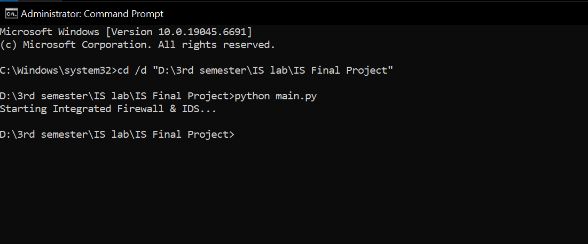
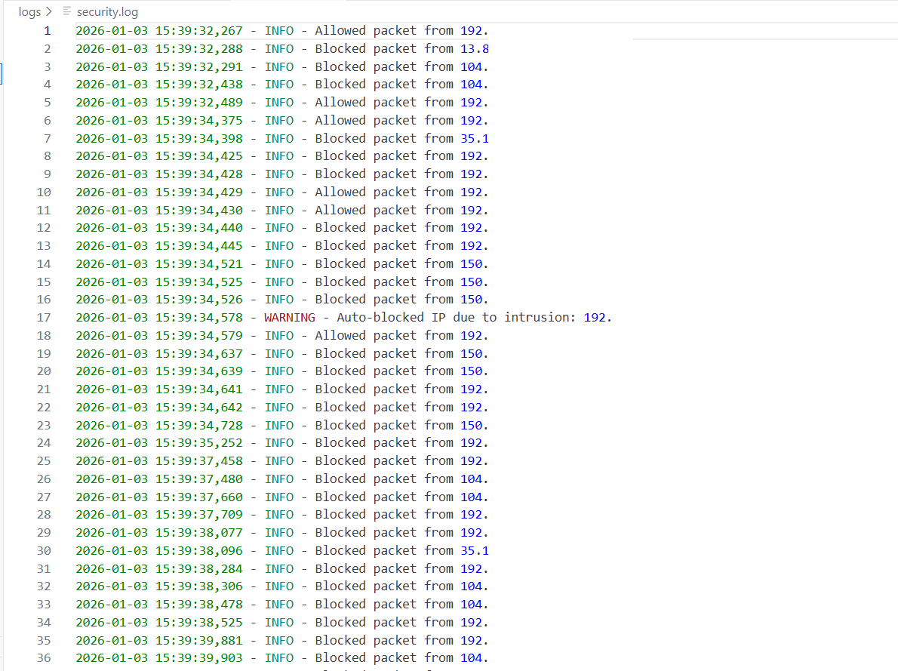

# PyGuard 🔐
**Python-based Information Security System**

PyGuard is an Information Security project developed in Python that demonstrates
core cybersecurity concepts such as packet sniffing, intrusion detection,
firewall rule enforcement, and automated response handling.

This project was built for academic and learning purposes to understand how
basic security mechanisms work at the system and network level.

---

## 🚀 Key Features
- 📡 Packet sniffing and traffic analysis
- 🛡 Intrusion Detection System (IDS)
- 🔥 Firewall rule enforcement
- 🧠 Automated response to threats
- 📝 Security event logging

---

## 🧩 Project Architecture
PyGuard/
│── main.py # Entry point
│── packet_sniffer.py # Network packet capture
│── ids.py # Intrusion detection logic
│── firewall.py # Firewall rules
│── response.py # Automated responses
│── logger.py # Logging module
│── rules.txt # Security rules
│── logs/ # Runtime logs (ignored in GitHub)

---

## 🛠 Technologies Used
- Python 3
- Network Security Concepts
- Git & GitHub
- VS Code

---

## ▶️ How to Run
```bash
python main.py

⚠️ Run as Administrator / Root for packet sniffing support.

🎓 Academic Note

This project was developed as part of an Information Security / Cybersecurity
course to demonstrate the practical implementation of security concepts.

## Screenshots

### Running PyGuard with Administrator Privileges



### Security Log Output


> Note: IP addresses in logs are masked for security and privacy.
